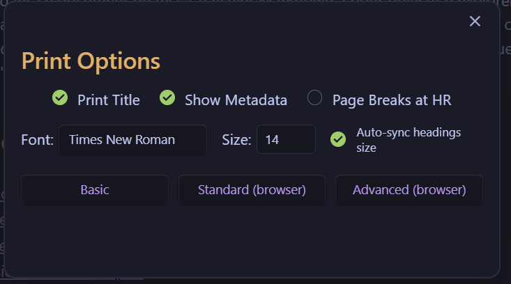

# Obsidian Print Plugin

Enhanced printing capabilities for Obsidian notes with multiple printing modes.

## Features

### Three Printing Modes

1. **Basic Mode**
   - Direct printing within Obsidian
   - Simple rendering of notes
   - Lightweight and fast

2. **Standard Mode**
   - Browser-based printing with enhanced options
   - Access to all standard browser printing capabilities
   - Same rendering quality as Basic mode

3. **Advanced Mode**
   - Enhanced rendering for complex elements
   - Full support for Mermaid diagrams, callouts, and icons
   - MathJax formulas not supported
   - Best visual fidelity (slightly slower)

### Print Options Modal

The print modal provides quick access to common settings:
- Choose between Basic, Standard, and Advanced printing modes
- Toggle page breaks at horizontal rules
- Include or exclude the note title
- Show or hide metadata

### Preview Functionality

- Preview your document before printing in all modes
- Full-window preview in browser modes (visible after canceling the print dialog)
- Press Ctrl+P in the preview window to reopen the print dialog if needed

### Additional Features

- Print selection from notes
- Print all notes in a folder
- Customizable header sizes and colors
- Metadata display in all printing modes

## Usage

- Use the ribbon icon or command palette to print the current note
- Right-click on a file or folder to access printing options
- Right-click in the editor to print the current note or selected text

## Settings

- Adjust font sizes for all elements including headers
- Customize header colors to match your preferences
- Use the "get theme colors" button to automatically import colors from your current theme (light mode colors)
- Enable/disable page breaks at horizontal rules
- Toggle metadata display
- Create custom CSS for advanced styling (use ".obsidian-smart-print" prefix for all selectors)