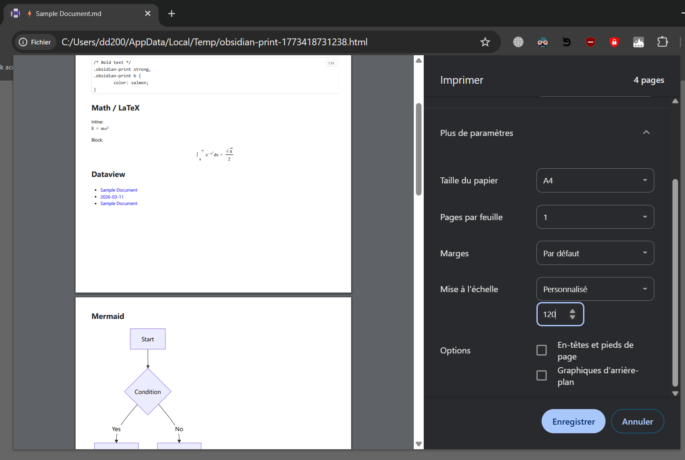
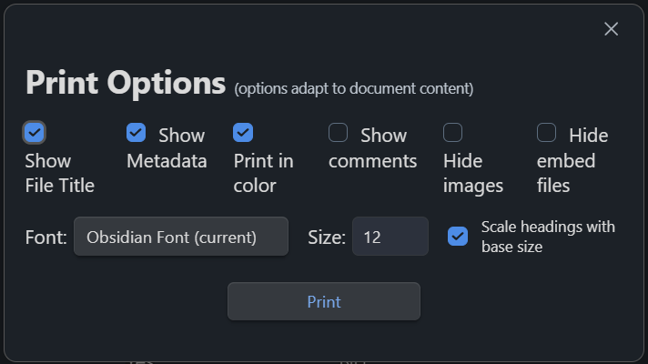

# Obsidian Smart Print

Enhanced and customizable printing for Obsidian notes, with intelligent rendering, live preview, and full control over fonts, headers, and styles.

**See the print quality:** [View print results gallery](examples/PRINT-RESULTS.md) | [View sample document](examples/sample.md)

## ⚠️ Desktop Only (Temporary)

**This plugin is currently desktop-only.** Mobile support exists in the code but has not been tested or debugged.

## Quick Start

1. **Install the plugin** and enable it
2. **Right-click in the editor** or on a file in the explorer
3. **Select a print option** from the context menu
4. **Adjust options** in the modal (optional)
5. **Print!** The plugin automatically uses the best rendering method

**Alternative ways to print:**

- **Right-click on files/folders** → Print from explorer
- **Right-click in editor** → Print note or selection
- **Command palette** → Search "Smart Print"
- **Ribbon icon** (optional, disabled by default) → Enable in settings

## Features

### 🎯 Intelligent Printing

Smart Print automatically chooses the best rendering method for your content:

- **Advanced rendering** (with post-render for Mermaid, Dataview, LaTeX, etc.) - ⚠️ Only available when the document is visible in the editor
- **Basic rendering** (no post-render) - Used for non-visible documents (other than the active note), selections, and folder prints. Also the only mode available on mobile
- **Automatic fallback** - Seamlessly switches between modes based on context

**What renders perfectly with advanced mode:**

- ✅ Mermaid diagrams
- ✅ Dataview queries
- ✅ Callouts with icons
- ✅ Tables, lists, code blocks
- ✅ Images and links
- ✅ Embedded images
- ✅ Nested checkboxes with proper indentation
- ✅ Custom theme colors
- ✅ Personalized styles with `.obsidian-print` CSS prefix

### 📋 Print Options Modal

Every print command opens a simple modal where you can:

- **Quick toggles** for common options. ⚠️ only relevant options are shown based on your document content:
  - Include note title
  - Show metadata (displayed at the end of the document)
  - Hide images (only if document contains images)
  - Hide embedded notes (only if document contains embeds)
  - Page breaks at horizontal rules (`---`) (only if document contains horizontal rules)
  - Show Obsidian comments (`%% ... %%`) (only if document contains comments)
  - Print in color or black & white
- **Font settings** with 20+ cross-platform font options
- **Auto-sync heading sizes:** All heading sizes automatically adjust when you change the **font size**

### 🎯 Multiple Ways to Print

**From anywhere in Obsidian:**

- **Ribbon icon** → Print current note
- **Command palette** → Search "Smart Print"
  - "Current note" - Print with modal
  - "Quick print" - Print immediately without modal
  - "Selection" - Print selected text only
  - "All notes in current folder" - Batch print
- **Right-click** on files/folders in explorer → Print options
- **Right-click** in editor → Print note or selection

**What you can print:**

- **Current note** (active document) - Advanced rendering
- **Selected text only** (from editor) - Basic rendering
- **Any note** (from file explorer) - Advanced rendering if visible in editor, otherwise basic
- **All notes in a folder** - Basic rendering because not visible

### 🌐 Browser-Based Printing in Desktop version

- **Opens in your default browser** for maximum compatibility and print options
- **Print window appears automatically** when the browser window opens
- **Tip:** Close the print window to view the preview window under, then press `Ctrl+P` (or `Cmd+P`) to reopen print window

## Settings Guide

### Font & Typography

- **Font family:** Choose from 20+ cross-platform fonts (Arial, Times, Roboto, Ubuntu, Georgia, Fira Code, and many more)
- **Font size:** Base size with automatic heading synchronization option
- **Auto-sync headings:** When enabled, changing the base font size automatically adjusts all heading sizes proportionally
- **Individual heading sizes:** Fine-tune each heading level (H1-H6) independently

### Colors & Styling

- **Header colors:** Set individual colors for each heading level
- **Import theme colors:** One-click import from your current theme (light mode)
- **Print in color:** Toggle between color and black & white output
- **Custom CSS:** Advanced styling with `.obsidian-print` prefix (desktop only)
  - Create a `print.css` file in `.obsidian/snippets/`
  - Use `.obsidian-print` as prefix for your selectors
  - Example: `.obsidian-print a { color: blue; text-decoration: underline; }`
  - No need for `!important` - your styles will apply automatically
  - The "Print in color" toggle in the modal will still work as expected

### Print Behavior

- **Page breaks:** Treat horizontal rules (`---`) as page breaks
- **Metadata display:** Include/exclude frontmatter in prints (displayed at the end of the document)
- **Hide images:** Toggle to exclude all images from print output
- **Folder printing:** Combine all notes or separate pages
- **Skip preview:** Print directly without preview window

### UI & UX

- **Show ribbon icon:** Toggle printer icon in left sidebar
- **Show context menu items:** Enable/disable right-click print options
- **Group in submenu:** Organize context menu items under "Smart Print" submenu
- **Show print mode selection:** Display options modal before printing (desktop only)
- **Show folder print options modal:** Display options when printing folders

## Tips & Tricks

💡 **Theme integration:** Use "Get theme colors" in settings to match your Obsidian theme

💡 **Auto-sync workflow:** Enable "Auto-sync heading sizes" for consistent typography – all headings automatically scale when you change the base font size

💡 **Font variety:** The plugin includes web-safe fonts and popular options like Roboto, Ubuntu, Georgia, and Fira Code for different document styles

💡 **Custom styling:** Create a `print.css` file in `.obsidian/snippets/` with `.obsidian-print` selectors. No `!important` needed - your styles apply automatically and respect the "Print in color" toggle

💡 **Quick printing:** Use "Quick print" command to skip the modal and print immediately

💡 **Folder printing:** Print entire folders with a dedicated modal for batch options

💡 **Mobile friendly:** Full feature support on mobile devices with optimized interface

💡 **Image control:** Use the "Hide images" toggle to print text-only versions of your notes

💡 **Metadata placement:** When enabled, frontmatter is displayed at the end of the document with a "Frontmatter" label

💡 **Embedded images:** The plugin automatically converts embedded images to base64 for reliable printing across all platforms

💡 **Embedded files:** Embedded notes (`![[note]]`) are rendered inline with a subtle border and title for easy identification 

💡 **Adaptive modal:** Print options automatically adapt to your document content - only relevant toggles are shown based on what's in your note

## Technical Details

### Rendering Strategy

Smart Print uses an intelligent capture strategy:

1. **Tries advanced DOM capture** - Captures the live preview exactly as you see it
2. **Falls back gracefully** - Uses standard Markdown rendering if DOM capture fails
3. **Handles edge cases** - Special handling for selections and non-active files

### Print Engines

- **Browser print** (desktop): Opens in system browser for maximum compatibility and options
- **Printd** (mobile/desktop): In-app printing with Electron/mobile print dialog
