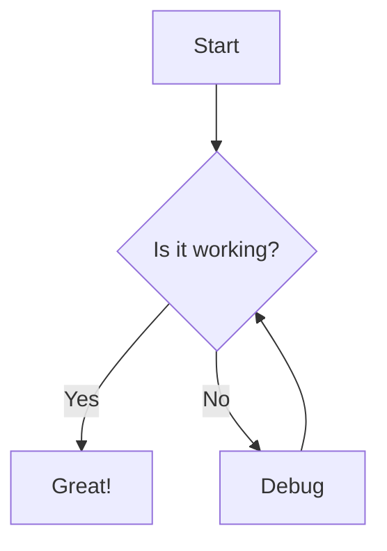
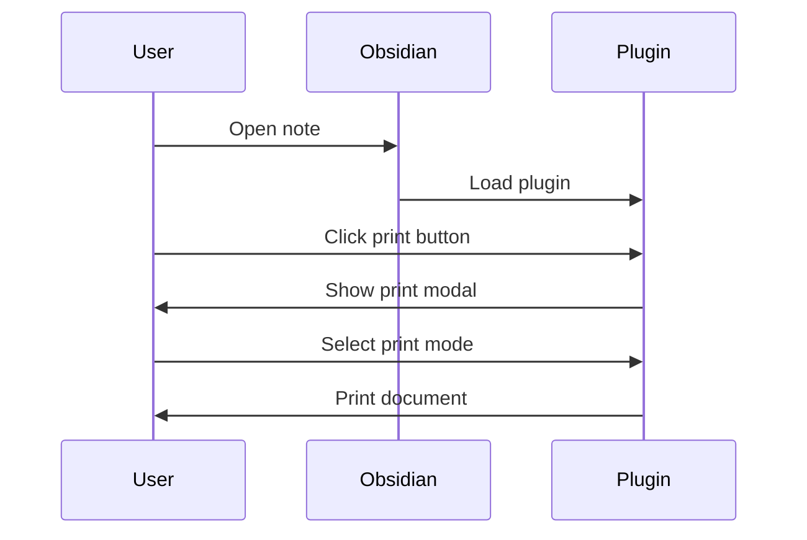

# Sample Document

This is a sample document demonstrating various Markdown and Obsidian features that can be printed with the Obsidian Print Plugin.

## Text Formatting

You can format text in various ways:
- **Bold text** for emphasis
- *Italic text* for slight emphasis
- ~~Strikethrough~~ for deleted content
- ==Highlighted text== for important information
- `inline code` for code snippets

## Lists

### Unordered Lists
- Item 1
- Item 2
  - Nested item 2.1
  - Nested item 2.2
- Item 3

### Ordered Lists
1. First item
2. Second item
   1. Nested item 2.1
   2. Nested item 2.2
3. Third item

### Task Lists
- [ ] Incomplete task
- [x] Completed task
- [ ] Another task with **formatted** text

## Blockquotes

> This is a blockquote
> 
> It can span multiple lines
> 
> > And can be nested

## Code Blocks

```javascript
// JavaScript code example
function greet(name) {
  console.log(`Hello, ${name}!`);
}

greet('Obsidian User');
```

## Tables

| Header 1 | Header 2 | Header 3 |
|----------|----------|----------|
| Cell 1   | Cell 2   | Cell 3   |
| Cell 4   | Cell 5   | Cell 6   |
| Cell 7   | Cell 8   | Cell 9   |

## Links

- [External link to Obsidian website](https://obsidian.md)
- [[Internal link to another note]]
- [Link with title](https://obsidian.md "Obsidian's Homepage")

## Images


## Horizontal Rule (Page Break)

---

## Callouts

> [!NOTE]
> This is a note callout in Obsidian.

> [!WARNING]
> This is a warning callout.

> [!INFO]
> Information callout with **formatted** text and a [link](https://obsidian.md).

> [!TIP]
> Here's a helpful tip!

## Mermaid Diagrams





## Math Equations (MathJax)

Inline equation: $E = mc^2$

Block equation:
$$
\frac{d}{dx}(x^n) = nx^{n-1}
$$

## Footnotes

Here's a sentence with a footnote[^1].

[^1]: This is the footnote content.

## YAML Frontmatter (Metadata)

```yaml
---
title: Sample Document
author: Obsidian User
date: 2023-06-15
tags: [sample, markdown, obsidian]
---
```

## Embedded Content

![[Another note]]

## Comments

%% This is a comment that won't be visible in preview mode %%

## Dataview (if you have the plugin)

```dataview
TABLE file.ctime AS "Created", file.mtime AS "Modified"
FROM "examples"
SORT file.mtime DESC
```