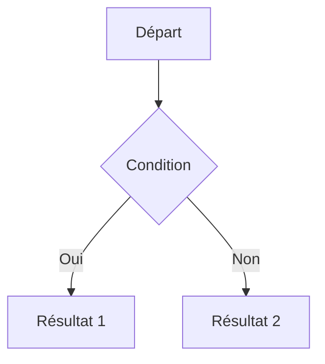

# Sample Document

This is a sample document demonstrating various Markdown and Obsidian features that can be printed with the Obsidian Print Plugin.

## Éléments complexes à tester

### Math / LaTeX
Inline : $E = mc^2$

Bloc :
$$
\int_0^\infty e^{-x^2} dx = \frac{\sqrt{\pi}}{2}
$$

### Mermaid

```mermaid
graph TD
    A[Départ] --> B{Condition}
    B -->|Oui| C[Résultat 1]
    B -->|Non| D[Résultat 2]
```

### Dataview
```dataview
LIST
FROM #tag
```

### Listes classiques (à puces et numérotées)
- Élément à puce 1
- Élément à puce 2
	- Puce imbriquée

1. Premier élément numéroté
2. Deuxième élément numéroté
	1. Numéro imbriqué

### Listes imbriquées avec checkboxes
- [ ] Tâche parent
	- [ ] Sous-tâche 1
	- [x] Sous-tâche 2
		- [ ] Sous-sous-tâche

### Espaces entre blocs de checkboxes
- [ ] Liste A

- [ ] Liste B (séparée par une ligne vide)

### Callout avec icône
> [!tip] Conseil
> Contenu du callout tip

### Image embarquée
![[test-image.png]]

### Lien interne
[[Nom d'une note]]

## Standard Markdown

### Text Formatting

- **Bold text** for emphasis
- _Italic text_ for slight emphasis
- ~~Strikethrough~~ for deleted content
- ==Highlighted text== for important information
- `inline code` for code snippets

### Tables

| Header 1 | Header 2 |
| -------- | -------- |
| Cell 1   | Cell 2   |
| Cell 3   | Cell 4   |

### Blockquotes

> This is a blockquote
>
> It can span multiple lines
>
> > And can be nested

### Code Blocks

```javascript
function greet(name) {
	console.log(`Hello, ${name}!`);
}
```

### Comments

%% This is a comment that won't be visible in preview mode %%
