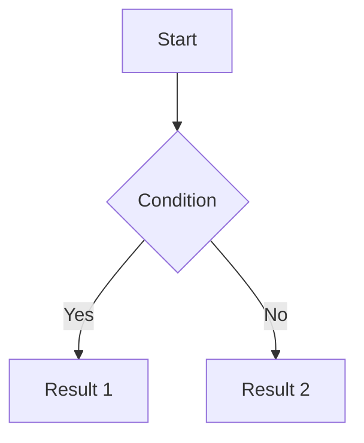

mettre à jour parfoisThis document strates the various Markdown and Obsidian features supported by the Smart Print Plugin.

## Text Formatting

- **Bold text** — rendered here with a custom color via a CSS snippet (see below)
- _Italic text_ for slight emphasis
- ~~Strikethrough~~ for deleted content
- ==Highlighted text== for important information
- `inline code` for codeC'est bizarre là. snippets

### CSS Snippet Override Example

The bold style above is overridden by the following snippet:

```css
/* Bold text */
.obsidian-print strong,
.obsidian-print b {
    color: salmon;
}
```

## Math / LaTeX

Inline: $E = mc^2$

Block:
$$
\int_0^\infty e^{-x^2} dx = \frac{\sqrt{\pi}}{2}
$$

## Dataview

```dataview
LIST
FROM #tag
```

## Mermaid


```mermaid
graph TD
    A[Start] --> B{Condition}
    B -->|Yes| C[Result 1]
    B -->|No| D[Result 2]
```

## Tables

| Header 1 | Header 2 |
| -------- | -------- |
| Cell 1   | Cell 2   |
| Cell 3   | Cell 4   |

## Lists

### Bullet and Numbered

- Item 1
- Item 2
    - Nested item

1. First item
2. Second item
    1. Nested number

### Checkboxes

- [ ] Parent task
    - [ ] Sub-task 1
    - [x] Sub-task 2
        - [ ] Sub-sub-task

### Separated Checkbox Blocks

- [ ] List A

- [ ] List B (separated by a blank line)

## Blockquotes

> This is a blockquote.
>
> It can span multiple lines.
>
> > And can be nested.

## Callout

> [!tip] Tip
> This is a tip callout with an icon.

## Embedded Image

![[Pasted image 20260313031134.png|200]]

## External Image


## Internal Link

[[Today]]

## Embed file

![[2026-03-12]]

## Comments

This comment below is hidden unless "Show Comments" is enabled in the print modal.

%% This is a hidden comment %%
